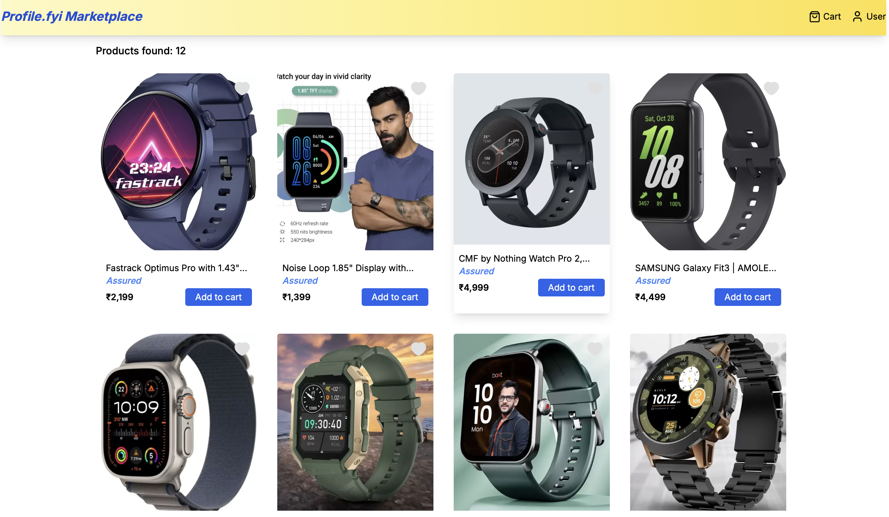
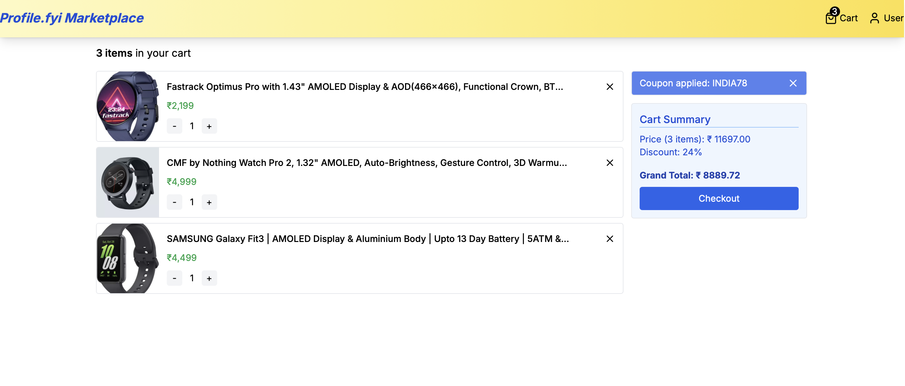

# Ecommerce Cart Application

<p align="center">
  
  &nbsp;
  
</p>

## 🚀 Features

- **Dynamic Shopping Cart**: Manage and view items effortlessly.
- **Discount Code Integration**: Apply discount codes for savings.
- **Responsive Design**: Optimized for all devices.

## 🛠️ Tech Stack

- **Next.js**: Server-side rendering and static site generation.
- **TypeScript**: Type safety for better development.
- **Redux Toolkit**: Efficient state management.
- **Tailwind CSS**: Utility-first CSS framework for styling.

## 🔧 Installation

To get started, install the necessary dependencies:

```bash
npm install
```

## 🚀 Running Locally

Launch the application locally with:

```bash
npm run dev
```

## 🎟️ Applying Discounts

To test discounts, use the following code in the cart:

- **Discount Code**: `INDIA78`

---

Feel free to adjust any details according to your preferences!
